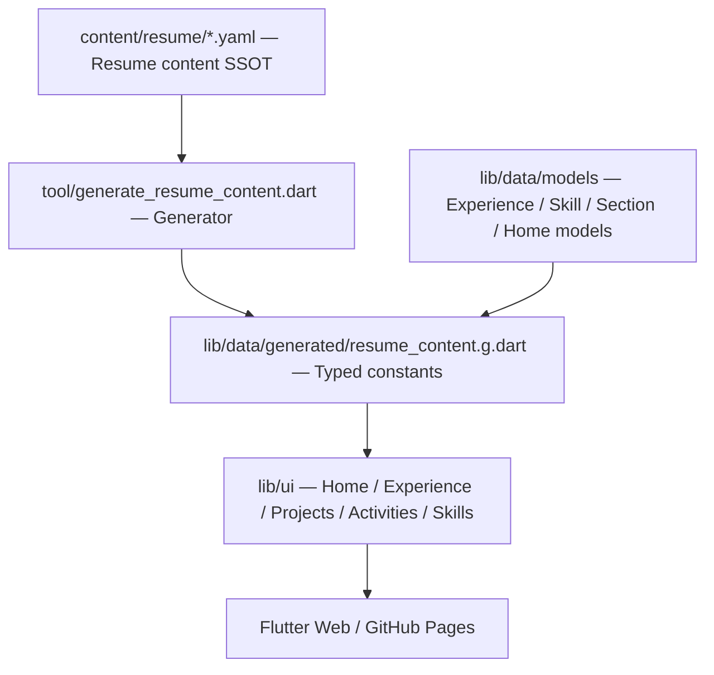

<!-- markdownlint-disable MD013 MD033 MD041 -->


# resume-flutter

Flutter Web で作成した、職務経歴・スキル・個人開発・その他活動を構造化して見せるポートフォリオ履歴書です。履歴書データは YAML を Single Source of Truth として管理し、生成済み Dart 定数を UI から参照します。

[](https://flutter.dev/)
[](https://dart.dev/)
[](./LICENSE)

ポートフォリオリポジトリのため外部 PR、一般的なサポート依頼、機能要望、通常のバグ報告は受け付けません。Issue は依存更新や公開リポジトリ運用上の衛生報告のために限定的に有効化しています。

公開ページ: <https://corvus400.github.io/resume-flutter/>

---

## 主な特徴

- **Flutter Web 製の履歴書 UI** — Home / Work Experience / Personal Projects / Outside Activities / Skills を Web で閲覧できる構成
- **AI 時代のモバイル開発を訴求** — Home のファーストビューで、AI 活用・設計力・検証力を軸にしたキャリアメッセージを表示
- **YAML SSOT のコンテンツ管理** — 職務経歴・スキル・活動・個人開発のデータを `content/resume/` に集約し、UI 実装と分離
- **生成コードの整合性チェック** — `tool/generate_resume_content.dart --check` を CI に組み込み、YAML と Dart 定数のずれを検出
- **レスポンシブな Web 体験** — desktop / phone の golden test と navigation contract test で表示崩れと遷移を確認
- **公開前 hardening** — MIT License、Security Policy、Issue forms、Dependabot / Renovate、GitHub Actions SHA pinning、画像メタデータ監査を適用

---

## 動かす

```bash
# 依存解決
flutter pub get

# 生成済みコンテンツの整合性確認
dart run tool/generate_resume_content.dart --check

# 開発起動
flutter run -d chrome
```

GitHub Pages と同じ base href でローカル build を確認する場合:

```bash
flutter build web --wasm --release --base-href /resume-flutter/
```

---

## コンテンツ管理

履歴書の本文データは `content/resume/` 配下の YAML を正とします。UI は YAML を直接読まず、生成済みの `lib/data/generated/resume_content.g.dart` を参照します。

```bash
# YAML 変更後に Dart 定数を再生成
dart run tool/generate_resume_content.dart

# CI と同じ整合性チェック
dart run tool/generate_resume_content.dart --check
```

この構成により、職務経歴・スキル・その他活動・個人開発のメンテナンス対象を UI 実装から分離しています。

---

## アーキテクチャ

Flutter UI、typed model、生成済み content、YAML source を分離しています。`lib/data/resume_data.dart` は公開 API として生成ファイルを再 export し、画面側は型付きデータだけを扱います。



---

## 開発

```bash
# 生成チェック
dart run tool/generate_resume_content.dart --check

# format
dart format --set-exit-if-changed .

# 静的解析
flutter analyze

# テスト
flutter test

# golden 更新が必要な UI 変更時
flutter test --update-goldens
```

### CI / Deploy

`main` への push で GitHub Pages へ deploy します。workflow 内では依存解決、生成チェック、静的解析、golden 以外の test、Flutter Web build を実行します。

Pull Request では `CI / ci-gate` が trust gate として動作します。外部 fork からの Pull Request は受け付けず、同一 repository からの owner / dependency bot PR だけを検証対象にします。

GitHub Actions は selected actions と SHA pinning を前提にしています。workflow の `uses:` を更新する場合は、許可リスト側も同じ commit SHA に合わせて更新してください。

---

## リポジトリ運用

- 依存関係更新の Pull Request は Dependabot が管理します。
- Renovate は Dependency Dashboard と grouped update の管理に利用します。
- GitHub Actions と workflow の依存更新は SHA pinning と selected actions を維持したまま手動レビューで適用します。
- 外部からの Pull Request はレビュー対象外です。
- 一般的なサポート・機能要望・バグ報告は GitHub Issues では受け付けていません。
- 公開 Issue は repository hygiene report のみに限定し、秘密情報・個人情報・脆弱性詳細を投稿しない導線にしています。
- セキュリティ報告は [SECURITY.md](./SECURITY.md) の手順に従ってください。

---

## セキュリティ / 公開前確認

- GitHub 履歴の author email は GitHub noreply に統一しています。
- tracked tree、Git 履歴、GitHub Issue / Pull Request / コメント / Actions log に対して、秘密情報・ローカル絶対パス・個人メールの混入を確認します。
- README 用画像と Web アイコン類は削除せず、表示に必要な画像データを残したまま不要な PNG メタデータだけを確認・除去します。
- GitHub Pages は静的配信のみで、サーバー側の秘密情報やユーザー入力保存はありません。
- 公開後は GitHub secret scanning / push protection / Dependabot security updates の有効化状態を確認します。

---

## ライセンス

本プロジェクトは [MIT License](./LICENSE) で公開しています。

### サードパーティソフトウェア

| ライブラリ / アセット | ライセンス | 用途 |
| --- | --- | --- |
| [Flutter](https://flutter.dev/) | BSD-3-Clause | Web アプリケーション実装 |
| [Dart](https://dart.dev/) | BSD-3-Clause | アプリケーション / generator 実装 |
| [Noto Sans JP](https://fonts.google.com/noto/specimen/Noto+Sans+JP) | SIL OFL 1.1 | `assets/fonts/` 配下に同梱。Reserved Font Name: "Noto" |
